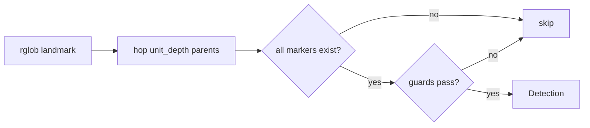

# Schemas & the data model

A **schema** is a single YAML file describing one data layout — a raw data
import, a processing run, a report bundle. It answers four questions:

- **What does it look like?** Detection markers that identify it on disk.
- **What is valid?** Required files/dirs, size and file-count bounds, failure markers.
- **Where are useful outputs?** Named `key_outputs` paths.
- **What metadata is encoded in paths?** Manifest extraction rules.

The exact fields are catalogued in the
[schema file reference](../reference/schemas.md); this page explains the model
behind them.

## The nouns

| Term | Meaning |
| --- | --- |
| **Schema** | One YAML spec for one data type (e.g. `csv-dataset`). |
| **Stage** | A directory whose children are units of that type. |
| **Unit** | One data unit directory — the thing you validate and sync. |
| **Files** | The unit's contents, filtered by the schema's `sync` rules. |

Running `atlas.detect()` returns a `Detection` per matched stage:

```python
import atlas

detections = atlas.detect("/data/project")    # -> list[Detection]
for d in detections:
    d.schema_name   # e.g. "csv-dataset"
    d.stage_path    # ABSOLUTE, resolved Path to the stage directory
    d.unit_ids      # child unit directory names
    d.sync_by       # "subdirectory"
```

## How detection works

Detection is fully declarative — a generic engine reads each schema's
`detection` block, so no data type has custom code. For each schema, atlas:

1. **Seeds on the landmark.** `detection.landmark` is rglob'd under the
   scanned root (a file, dir, or either, per `landmark_type`). A schema with
   no landmark is validation-only and never detected.
2. **Hops to the unit directory.** `unit_depth` is the number of `.parent`
   hops from the landmark to the unit dir.
3. **Confirms the markers.** ALL paths in `detection.markers` must exist
   under the candidate unit dir.
4. **Applies the guards.** Optional checks can require at least one glob
   match (`require_any_glob`), require the landmark's parent dir name
   (`landmark_parent`), or skip the candidate entirely
   (`exclude_if_markers`, `exclude_if_cmdline_subcommand`).



When `atlas detect` finds nothing, it is almost always a landmark/depth
mismatch — the [detection runbook](../runbooks/detection-empty.md) lists every
built-in's landmark and depth.

## How validation works

`atlas validate` (and `atlas.validate_data_unit()`) checks a unit directory
against the schema's `validate` block and reports **all** findings — it does
not stop at the first problem:

- **Errors** fail validation: missing `required` files or `required_dirs`, no
  match across a `required_any` alternative group, any `fail_on` glob match
  (a failure marker like `_errors`), or size/count bounds out of range.
- **Warnings** don't: `warn_if_missing` paths and `filename_pattern`
  non-matches are advisory.

Size, file-count, and filename checks run on the **post-sync file list** —
the files selected by `sync.include` minus `sync.exclude` (exclude wins) —
so validation judges exactly the files that would travel. Interpreting the
output is covered in the
[validation runbook](../runbooks/validation-failures.md).

## Schema resolution & override

`resolve_schema(name, project_root)` searches, in order:

1. **Explicit path**: `name` is absolute, or ends in `.yaml`/`.yml`
   (relative paths resolve against `project_root`, not the CWD).
2. **Project-local**: `{project_root}/schemas/{name}.yaml` or
   `{project_root}/schemas/{name}.yml`
3. **User-wide**: `~/.atlas/schemas/{name}.yaml` or
   `~/.atlas/schemas/{name}.yml`
4. **Built-in**: packaged `atlas.schemas` data.

The first hit wins, so a project- or user-local schema **overrides** a
built-in of the same name. `SchemaError` is raised if nothing matches — see
the [schema-not-found runbook](../runbooks/schema-not-found.md).

## One YAML, zero Python

Everything a data type needs lives in its single schema YAML, and every field
is enforced:

- **`detection`** drives `atlas detect` via the declarative engine above.
- **`validate`** drives `atlas validate`: existence, bounds, fail-on
  patterns, and the `filename_pattern` regex (a bad regex is rejected at
  load time).
- **`sync`** and **`key_outputs`** define which files travel and where the
  useful outputs are.

Adding a new data type means [writing one YAML](../guides/custom-schemas.md)
— no registration, no code change.

atlas itself stays standalone while doing all this: its runtime uses `click`,
`pydantic`, `pyyaml`, `pandas`, and `openpyxl`, and other tools import it — never the
reverse. The reasoning is recorded in
[ADR-0001](../adr/0001-atlas-is-standalone.md) and
[ADR-0003](../adr/0003-pandas-manifests.md).
